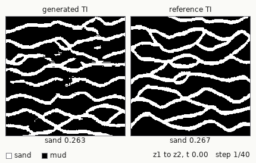
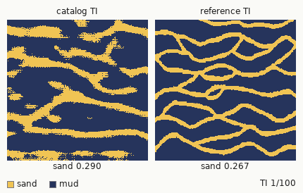
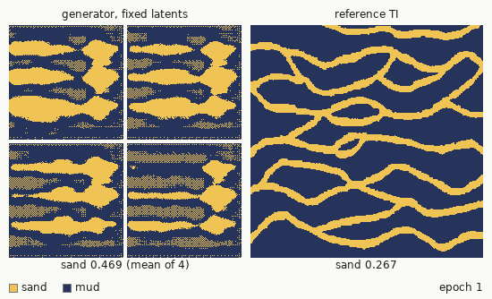
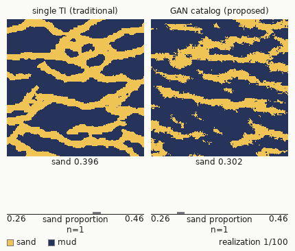

# gan-uncertainty

Code to reproduce the workflow of Scholze, Bassani and Costa (2023), *Generative Adversarial Networks to incorporate the Training Image uncertainty in multiple-point statistics simulation*, Geoenergy Science and Engineering 230, 212257. Paper: <https://doi.org/10.1016/j.geoen.2023.212257>.

Most multiple-point statistics (MPS) workflows draw every realization from one training image (TI), so the uncertainty about the TI itself is ignored and spatial uncertainty is understated. Here a WGAN-GP learns the patterns of a reference TI (Strebelle's 250x250 fluvial channels) and samples a catalog of TIs. Each catalog TI conditions one SNESIM realization. Realizations from the single reference TI form the baseline, and both workflows condition on the same well data (`samples50`). The paper concludes that the catalog workflow gives higher uncertainty and variability. This re-run agrees in direction, with a small margin (see Results).

| Latent walk | TI catalog |
|---|---|
|  |  |
| A path through the latent space, with the reference TI alongside. | Catalog TIs, each labelled with its sand proportion. |

| Training | Realizations |
|---|---|
|  |  |
| The same four latents at each saved epoch. | Baseline (left) and catalog (right) realizations, with running histograms. |

## Results (this repo's re-run, not the paper's figures)

Seed 69096, 50 epochs on an RTX 5090, 100 catalog TIs, 100 realizations per workflow. Sand proportion:

| Set | n | Mean | Std | Min | Max |
|---|---|---|---|---|---|
| Reference TI | 1 | 0.2674 | | | |
| Catalog TIs | 100 | 0.3020 | | 0.139 | 0.385 |
| Realizations, single TI (baseline) | 100 | 0.3467 | 0.0280 | 0.2896 | 0.4107 |
| Realizations, GAN catalog | 100 | 0.3419 | 0.0300 | 0.2767 | 0.4288 |

78 of the 100 catalog TIs lie within 0.05 of the reference proportion, and 3 differ by more than 0.10. The catalog realizations spread slightly more than the baseline (std 0.0300 against 0.0280). The generator is under-trained relative to the paper: the critic loss had not levelled off at epoch 50, and about 30-40% of sampled tiles are clean channel networks while 20-30% are grainy. Realization means (about 0.34) sit above the reference proportion. Conditioning on well data is expected to shift them; this run did not test that. The two workflows also differ in TI size: the baseline uses the full 250x250 reference, and each catalog TI is 150x150, the window size the generator trains on.

## Reproduce

Needs [mise](https://mise.jdx.dev). It installs Python 3.11. `setup` builds `.venv` and installs torch 2.11 from the CUDA 12.8 wheel index (required by RTX 50-series GPUs; the code falls back to the CPU). Nothing pretrained ships; every artifact regenerates. The SNESIM step needs Windows (`snesim.exe`).

```
mise run setup    # .venv and dependencies
mise run train    # WGAN-GP; 50 epochs take about 2 h on a GPU (5 epochs on a CPU: an estimated 10 h)
mise run sample   # the TI catalog, into outputs/
mise run snesim   # one realization per catalog TI, plus the single-TI baseline
mise run gifs     # docs/*.gif
mise run check    # compile, catalog shape, facies-proportion assertion
```

`mise run figures` writes the figure set, `mise run docs` verifies the project page, and `mise run all` chains everything. `train`, `sample`, `snesim` and `gifs` take `--seed` (default 69096); run `mise run <task> -- --help` for the flags.

## Differences from the 2022 code

- The generator output is binarised at 0 instead of 0.5. For a 5-epoch generator, 0 gives a catalog sand proportion of 0.264 against 0.267 for the reference; 0.5 gave 0.19.
- The SSIM >= 0.9 filter in sampling is gone. A dtype bug meant it never filtered, and the SSIM between independent TIs is at most about 0.3.
- The TI file is `strebelle.out`, renamed from `ti_strebelle.out` because `snesim.exe` rejects file names over 30 characters.

## Cite

```bibtex
@article{scholze2023gan,
  author  = {Scholze, Gustavo Pretto and Bassani, Marcel Antonio Arcari and Costa, Jo{\~a}o Felipe Coimbra Leite},
  title   = {Generative Adversarial Networks to incorporate the Training Image uncertainty in multiple-point statistics simulation},
  journal = {Geoenergy Science and Engineering},
  volume  = {230},
  pages   = {212257},
  year    = {2023},
  doi     = {10.1016/j.geoen.2023.212257}
}
```

`CITATION.cff` carries the same reference for GitHub's "Cite this repository". SNESIM: Strebelle (2002); open implementation: Remy et al. (2009).

## Licence

GNU General Public License v3, see `COPYING.txt`.
